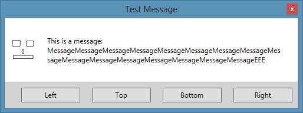

# Initialization
Just add the Gat.Controls.MessageBox.dll to your References. No further dependencies are needed.

# Usage
## General

{code:c#}
Gat.Controls.MessageBoxView messageBox = new Gat.Controls.MessageBoxView();
Gat.Controls.MessageBoxViewModel vm = (Gat.Controls.MessageBoxViewModel)messageBox.FindResource("ViewModel");
vm.Show("Message..", "Caption", Gat.Controls.MessageBoxButton.OkCancel, Gat.Controls.MessageBoxImage.Question);
{code:c#}

## More Customized

{code:c#}
Gat.Controls.MessageBoxView messageBox = new Gat.Controls.MessageBoxView();
Gat.Controls.MessageBoxViewModel vm = (Gat.Controls.MessageBoxViewModel)messageBox.FindResource("ViewModel");

vm.Message = "This is a message: MessageMessageMessageMessageMessageMessageMessageMessageMessageMessageMessageMessageMessageMessageMessageMessageEEE";
vm.Ok = "Left";
vm.Cancel = "Right";
vm.Yes= "Top";
vm.No= "Bottom";
vm.OkVisibility = true;
vm.CancelVisibility = true;
vm.YesVisibility = true;
vm.NoVisibility = true;
vm.Image = new BitmapImage(new System.Uri("pack://application:,,,/Image.bmp"));
vm.Caption = "Test Message";

// Center functionality
vm.Position = MessageBoxPosition.CenterOwner;
vm.Owner = this;

vm.Show();
{code:c#}

## Taking result into account

{code:c#}
Gat.Controls.MessageBoxResult result = vm.Show();
if(result == Gat.Controls.MessageBoxResult.Ok)
{
...
}
{code:c#}

