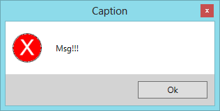
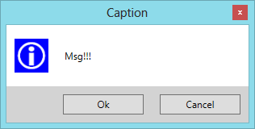
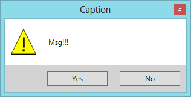
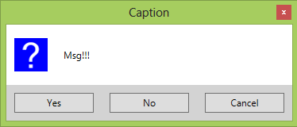
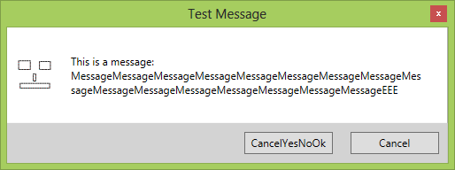

**Project Description**
WPF Message Box is a simple and free message box for WPF using MVVM pattern. Image, buttons, message, and caption can be set.

# Features
* Display your message
* Set a caption
* Choose one of the default images (Inforamtion, Question, Warning, Error)
* Use your own stylish image
* Choose one of the default buttons (Ok, OkCancel, YesNo, YesNoCancel)
* Set the visibility of the buttons by your own (up to four buttons can be visible)
* Display individual text on the buttons
* Recognize the pressed button
* Set the default button of the message box

# Screenshots

Error message with one Ok button:
 

Information message with Ok and Cancel buttons:

Warning message with Yes and No buttons:
 

Question message with Yes, No and Cancel buttons:

Customized message with two buttons. Image and text of one button are customized. A longer message is displayed:

# Miscellaneous
* You can also create your own View using the existing ViewModel

